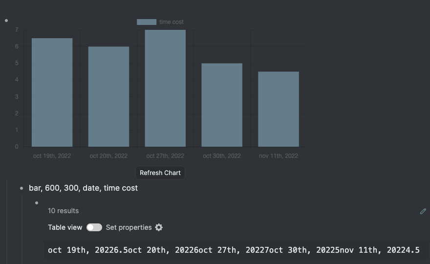
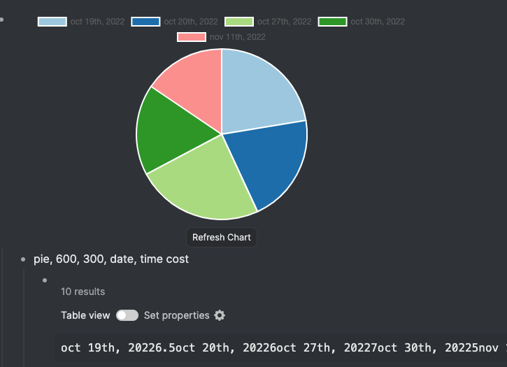
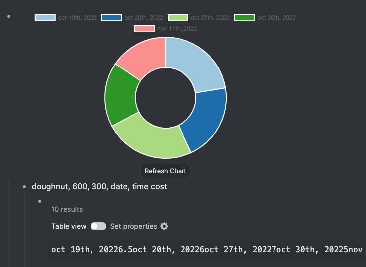
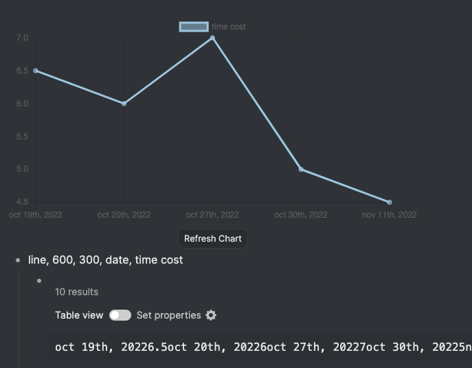
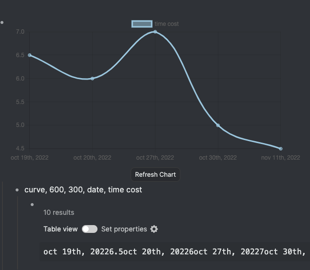
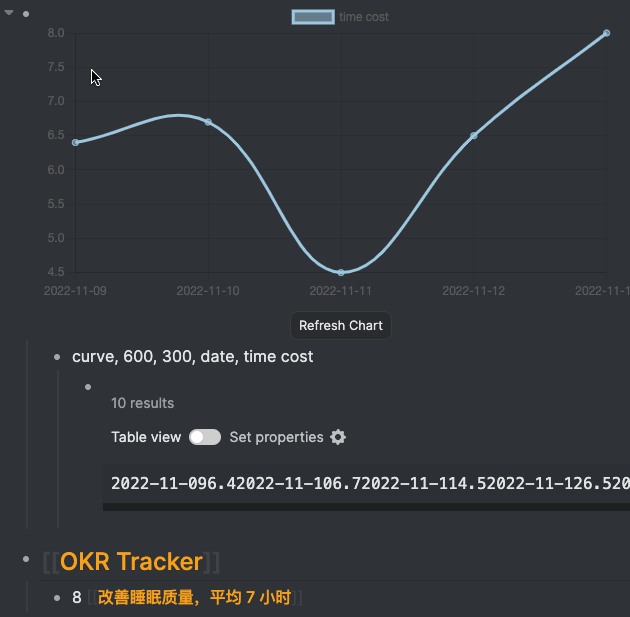

# Logseq Plugin Query Chart

## Introduction (简介)
This plugin can create a chart according to the result of advanced query, so that you can visualize any data in your logseq as you want.

这个插件能根据高级查询的结果绘制图表。帮助你可视化logseq中记录的数据。
## Usage (使用)

1. Use slash command `/Insert Query Chart` to insert a chart.
2. Write down the options of chart in the child block. Options including:
    * chart type
    * width
    * height
    * color scheme (optional)
    * labels of data
3. Write advanced query in grand child block.

<!--  -->
1. 使用斜杠命令 `/Insert Query Chart` 插入图表。
2. 在子块中写入图表的一些设置选项。包括：
    * 图表类型
    * 图表宽度
    * 图表高度
    * 颜色 (可选)
    * 数据的标签
3. 在子块的子块中写入需要绘图的高级查找。


### Supported chart type (支持的图表类型)
* bar (柱状图)

* pie (饼图)

* doughnut (环形图)

* line (折线图)

* curve (曲线图)


### Color Scheme (配色方案)
Check this [link](https://nagix.github.io/chartjs-plugin-colorschemes/colorchart.html) for all supported color schemes. Default color scheme is `brewer.Paired12`.

所有配色方案请参考[此链接](https://nagix.github.io/chartjs-plugin-colorschemes/colorchart.html). 默认配色方案为`brewer.Paired12`。


### Advanced query (高级查询)
You need to write a query whose result is a list of array. Take the following query as an example.

你需要写一个带有数组返回结果的查询。以下面这个查询为例
```clojure
  :query [:find ?x ?y
          :in $ ?start ?today
          :where
          [?b :block/content ?x]
          [?b :block/page ?journal]
          [?journal :block/journal-day ?d]
          [(>= ?d ?start)]
          [(<= ?d ?today)]
          [?b :block/priority ?y]
  ]
  :inputs [:-7d :today]
```
The result would be like `[task1, A], [task2, B], [task3, C], ...`
For x-y plot, the first elements in each array formats the data on x-axis.

查询结果将为`[task1, A], [task2, B], [task3, C], ...`。对于x-y形式坐标系的图，第一个元素是横轴的标签。

It is recommended to use the relative date input if you need date/time paremeter. Check the usage in [official document](https://docs.logseq.com/#/page/advanced%20queries)

如果你需要日期或者时间作为查询参数，建议使用相对日期的形式，详见[官方文档](https://docs.logseq.com/#/page/advanced%20queries)

## Example (示例)
I have page like the following one. I log the sleep time as `sleep-time [[改善睡眠质量，平均7小时]]`

我有如下形式的页面。我会以`睡眠时间 [[改善睡眠质量，平均7小时]]`的形式记录睡眠时间。
```markdown
## [[OKR Tracker]]
  - 6 [[改善睡眠质量，平均7小时]]
```
The query I used to generate a chart for the last 7 days is

我用如下查询绘制过去7天的睡眠时间曲线
```clojure
{
  :query [:find ?date ?result
          :in $ ?start ?today ?kr
          :where
          [?b :block/parent ?p]
          [?p :block/refs ?pr]
          [?b :block/refs ?ref]
          [?ref :block/name ?kr]
          [?b :block/page ?journal]
          [?journal :block/name ?date]
          [?journal :block/journal-day ?d]
          [(>= ?d ?start)]
          [(<= ?d ?today)]
          [?b :block/content ?content]
          [?pr :block/name "okr tracker"]
          [(re-pattern "([\\d\\.]+)\\s\\[\\[.*\\]\\]") ?reg]
          [(re-find ?reg ?content) ?c]
          [(get ?c 1) ?result]
  ]
  :inputs [:5d-before :today "改善睡眠质量，平均7小时"]
}
```
The chart is

图表如下



## TODOs
- [ ] Custom colorscheme

## Credit
* [Logseq Plugin Starter Vite](https://github.com/vipzhicheng-starter/logseq-plugin-starter-vite)
* [chart.js](https://www.chartjs.org/)
* [vue-chartjs](https://vue-chartjs.org/)
* Inspired by [logseq-chartrender-plugin](https://github.com/hkgnp/logseq-chartrender-plugin)

## Licence
MIT
